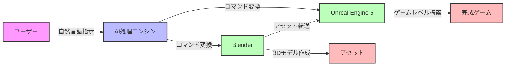
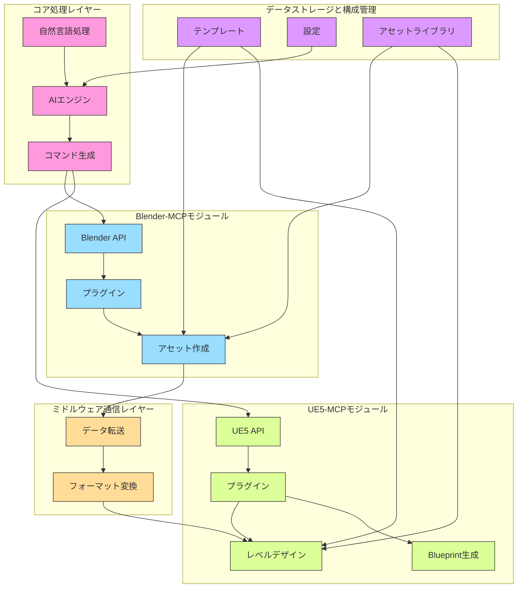
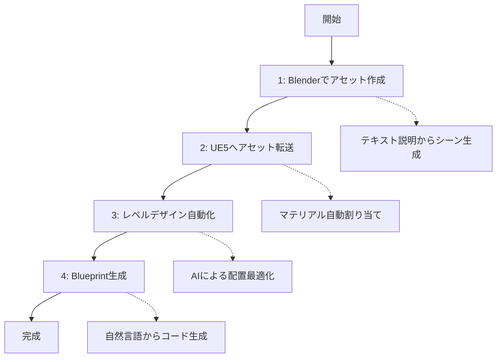

# UE5-MCP：AIによるゲーム開発革命

## 概要

ゲーム開発の世界では、クオリティとスピードの両立が常に課題となっています。特に3Dアセット作成、レベルデザイン、ゲームプレイプログラミングは多大な時間と専門知識を要します。本記事では、これらの課題を解決する可能性を秘めた「UE5-MCP（Model Control Protocol）」について深掘りします。BlenderとUnreal Engine 5（UE5）のワークフローにAI駆動の自動化を統合するこのプロジェクトは、ゲーム開発の効率と創造性を飛躍的に向上させる可能性を秘めています。

## 目次

1. [はじめに：ゲーム開発の課題](#はじめにゲーム開発の課題)
2. [UE5-MCPとは](#ue5-mcpとは)
3. [革新的な機能](#革新的な機能)
   - [AI駆動のシーン生成](#ai駆動のシーン生成)
   - [Unreal Engine統合](#unreal-engine統合)
   - [アセット管理と作成](#アセット管理と作成)
   - [ゲームプレイプログラミングとデバッグ](#ゲームプレイプログラミングとデバッグ)
4. [技術アーキテクチャ](#技術アーキテクチャ)
5. [実践的なワークフロー](#実践的なワークフロー)
6. [ユースケース分析](#ユースケース分析)
7. [導入への道筋](#導入への道筋)
8. [将来の展望](#将来の展望)
9. [まとめ](#まとめ)

## はじめに：ゲーム開発の課題

現代のゲーム開発は、かつてないほど複雑化しています。プレイヤーの期待値は年々高まり、AAA級のビジュアルとゲームプレイが中小規模のスタジオにも求められるようになりました。この状況下で開発者が直面する主な課題は：

- **リソースの制約**: 時間、予算、人材の限界
- **技術的複雑さ**: 複数のソフトウェア間でのワークフロー管理
- **反復的な作業**: 手動での繰り返し作業による創造性の阻害
- **専門知識の壁**: 3Dモデリング、テクスチャリング、プログラミングなど多岐にわたる専門知識の必要性

これらの課題に対して、AIと自動化が救世主となる可能性があります。特にBlenderとUnreal Engine 5という業界標準ツールの統合ワークフローを自動化することで、開発効率を劇的に向上させることができます。

## UE5-MCPとは

UE5-MCP（Model Control Protocol）は、BlenderとUnreal Engine 5のワークフローにAI駆動の自動化を統合するプロジェクトです。[BlenderMCP](https://github.com/ahujasid/blender-mcp)をベースに拡張され、AIを活用したゲームレベル作成のためのエンドツーエンドパイプラインを提供します。

このプロジェクトの核心は、自然言語指示をBlenderとUE5内での具体的なアクションに変換する能力にあります。例えば、「中世の村を生成して」という指示から、適切な建物、地形、テクスチャを持つ完全な3Dシーンを自動的に作成することができます。



上図はUE5-MCPの基本的な概念を示しています。ユーザーの自然言語指示がAI処理エンジンによって解釈され、BlenderとUnreal Engine 5への具体的なコマンドに変換されます。これにより、3Dアセット作成からゲームレベル構築までの一連のプロセスが自動化されます。

## 革新的な機能

### AI駆動のシーン生成

UE5-MCPの最も印象的な機能の一つは、テキスト説明からの3Dシーン生成です。

```bash
mcp.generate_scene "サイバーパンク都市の夜景。高層ビル、ネオンサイン、飛行車がある"
```

このようなシンプルなコマンド一つで、AIは：

1. シーンの全体的な構造を理解
2. 適切なオブジェクト（建物、車、街灯など）を配置
3. 空間的関係と比率を考慮
4. 適切なライティングとアトモスフェアを設定

さらに、画像を参照としたシーン生成も可能で、アートディレクションの一貫性を維持しながら3D環境を構築できます。

### Unreal Engine統合

BlenderとUE5間のシームレスな統合は、UE5-MCPの大きな強みです。従来、この二つのソフトウェア間でのアセット転送は手動で行う必要があり、テクスチャやマテリアルの再設定など多くの作業が発生していました。

UE5-MCPは以下のような機能でこの問題を解決します：

- **自動シーンインポート**: BlenderからUE5へのシームレスな転送
- **マテリアルとライティング転送**: 視覚的一貫性の維持
- **レベル最適化**: インポートされたシーンの自動パフォーマンス最適化

```bash
# BlenderからUE5へのシームレスな転送例
mcp.import_to_ue5 "blender_scene.fbx" --maintain-hierarchy
```

### アセット管理と作成

3Dアセットの作成と管理は、ゲーム開発の中でも特に時間を要する工程です。UE5-MCPはこの領域でも革新をもたらします：

- **AIによる3Dモデル生成**: テキスト説明から直接モデルを生成
- **テクスチャとマテリアルの自動生成**: 「錆びた金属」などの説明から適切なテクスチャを作成
- **アセットバリエーションの自動生成**: 基本モデルから複数のバリエーションを生成

特に注目すべきは、LOD（Level of Detail）の自動生成機能です。これにより、パフォーマンスを最適化しながら視覚的品質を維持することができます。

```bash
# LODの自動生成例
mcp.generate_lods "building_model" --levels 3
```

### ゲームプレイプログラミングとデバッグ

UE5-MCPはモデリングだけでなく、ゲームプレイロジックの実装も支援します：

- **Blueprint自動生成**: 自然言語の説明からUE5 Blueprintを生成
- **AIによるコード生成**: ゲームプレイ機能の説明からC++コードを生成
- **パフォーマンスプロファイリング**: ゲームレベルの自動分析と最適化提案

```bash
# Blueprint自動生成の例
mcp.generate_blueprint "プレイヤーが近づくと開き、離れると閉じるドア"
```

この機能により、プログラミングの専門知識がないデザイナーでも、複雑なゲームプレイメカニクスを実装できるようになります。

## 技術アーキテクチャ

UE5-MCPのアーキテクチャは、モジュール性と拡張性を重視して設計されています。主要コンポーネントは以下の通りです：

1. **コア処理レイヤー**: AI対話と自然言語処理を担当
2. **Blender-MCPモジュール**: Blender APIとの統合
3. **UE5-MCPモジュール**: Unreal Engine 5との統合
4. **ミドルウェア通信レイヤー**: BlenderとUE5間の橋渡し
5. **データストレージと構成管理**: 設定とテンプレートの管理

特筆すべきは、複数のAIプロバイダー（OpenAI GPT、Stable Diffusion、Claude AI）をサポートしている点です。これにより、異なるタスクに最適なAIモデルを選択できます。



上図はUE5-MCPの技術アーキテクチャを示しています。各レイヤーが連携して動作し、自然言語指示からゲームレベル作成までのエンドツーエンドパイプラインを実現しています。

```json
// AI設定例
{
  "ai_integration": {
    "provider": "openai",
    "api_key": "your-api-key",
    "ai_suggestions": true
  }
}
```

## 実践的なワークフロー

UE5-MCPの実際のワークフローは、以下のステップで構成されています：



上図はUE5-MCPを使用した実践的なワークフローを示しています。各ステップが順序立てて実行され、アイデアから完成したゲームレベルまでの時間を大幅に短縮できます。

### ステップ1: Blenderでのアセット作成
1. Blenderを開き、MCPプラグインをロード
2. テキスト説明からシーンを生成
3. 必要に応じてオブジェクトを追加・調整
4. テクスチャを適用
5. UE5用にアセットをエクスポート

### ステップ2: UE5へのアセット転送
1. BlenderからエクスポートしたファイルをUE5にインポート
2. MCPツールでアセットを処理・最適化
3. マテリアルとテクスチャを自動割り当て

### ステップ3: UE5でのレベルデザイン自動化
1. 手続き型地形を生成
2. アセットを自動配置
3. AIによる配置の洗練

### ステップ4: Blueprint自動化とゲームプレイロジック
1. 自然言語説明からBlueprintを生成
2. テストと反復
3. パフォーマンスの問題をデバッグ

このワークフローにより、アイデアから完成したゲームレベルまでの時間を大幅に短縮できます。

## ユースケース分析

UE5-MCPが特に威力を発揮するユースケースを分析してみましょう：

### 1. インディーゲーム開発
小規模チームでも大規模な3D環境を作成可能に。限られたリソースで質の高いコンテンツを生産できます。

### 2. プロトタイピング
アイデアを素早く形にし、検証することができます。「森の中の神殿」といった概念を数分で視覚化できます。

### 3. 教育
ゲーム開発を学ぶ学生が、技術的な障壁を低く抑えながら創造性を発揮できます。

### 4. 大規模プロジェクトの効率化
AAA級スタジオでも、反復的なタスクを自動化することで、アーティストやプログラマーがより創造的な作業に集中できます。

## 導入への道筋

UE5-MCPを自分のプロジェクトに導入するには、以下のステップが必要です：

1. **環境準備**: Blender、UE5、Python 3.xのインストール
2. **UE5-MCPのインストール**: リポジトリのクローンと依存関係のインストール
3. **Blenderと UE5の設定**: 必要なプラグインの有効化
4. **AI APIキーの取得**: OpenAIなどのAPIキーを取得して設定
5. **設定ファイルの構成**: ワークフローに合わせた設定のカスタマイズ

導入の難易度は中程度ですが、一度セットアップすれば、その恩恵は計り知れません。

## 将来の展望

UE5-MCPのような技術は、ゲーム開発の未来をどのように変えるでしょうか？

### 1. 民主化の加速
高品質なゲーム開発がより多くの人々にアクセス可能になります。技術的な障壁が低くなることで、新しい声や視点がゲーム業界に入ってくるでしょう。

### 2. 創造性の解放
開発者は反復的なタスクから解放され、より創造的な側面に集中できるようになります。「どうやって作るか」ではなく「何を作るか」に焦点を当てられます。

### 3. AIとの共同作業の新時代
将来的には、AIはただのツールではなく、創造的なパートナーとなるでしょう。開発者のアイデアを理解し、拡張する存在になる可能性があります。

### 4. 新しいゲームジャンルの誕生
制作コストとリスクが下がることで、より実験的で革新的なゲームが生まれる可能性があります。

## まとめ

UE5-MCPは、AIと自動化の力を活用してゲーム開発の効率と創造性を高める画期的なプロジェクトです。BlenderとUnreal Engine 5の統合ワークフローを自動化することで、開発者は技術的な障壁を乗り越え、より自由に創造性を発揮できるようになります。

特に注目すべき点は：

- テキスト説明からの3Dシーン生成
- BlenderとUE5間のシームレスな統合
- AIによるアセット作成と最適化
- 自然言語からのBlueprintとゲームプレイロジックの生成

これらの機能は、ゲーム開発の民主化と創造性の解放に大きく貢献するでしょう。UE5-MCPのようなツールが普及することで、ゲーム開発の未来はより明るく、多様で、創造的なものになると期待できます。

AIと人間のクリエイターが協力して作り出す次世代のゲーム体験に、今から期待が高まります。

## 参考リンク

- [UE5-MCP GitHub リポジトリ](https://github.com/your-repo/UE5-MCP)
- [Blender 公式サイト](https://www.blender.org/)
- [Unreal Engine 5 公式サイト](https://www.unrealengine.com/)
- [BlenderMCP プロジェクト](https://github.com/ahujasid/blender-mcp)
- [OpenAI API ドキュメント](https://platform.openai.com/docs/api-reference)